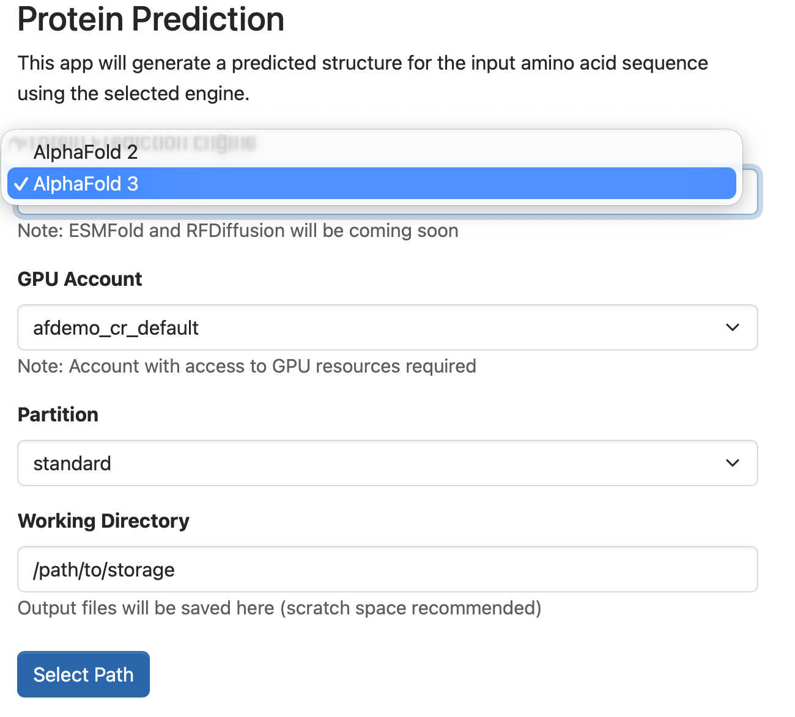
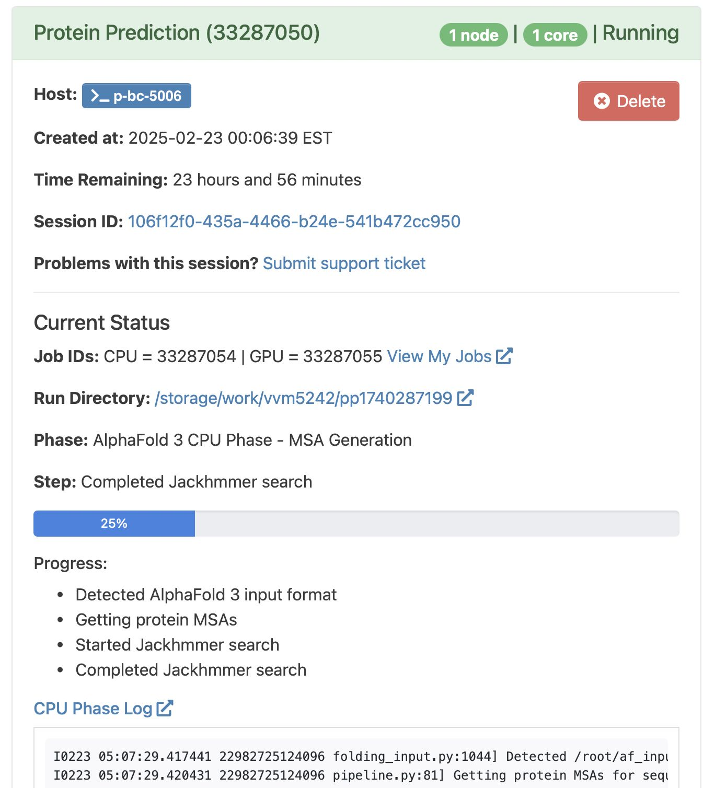
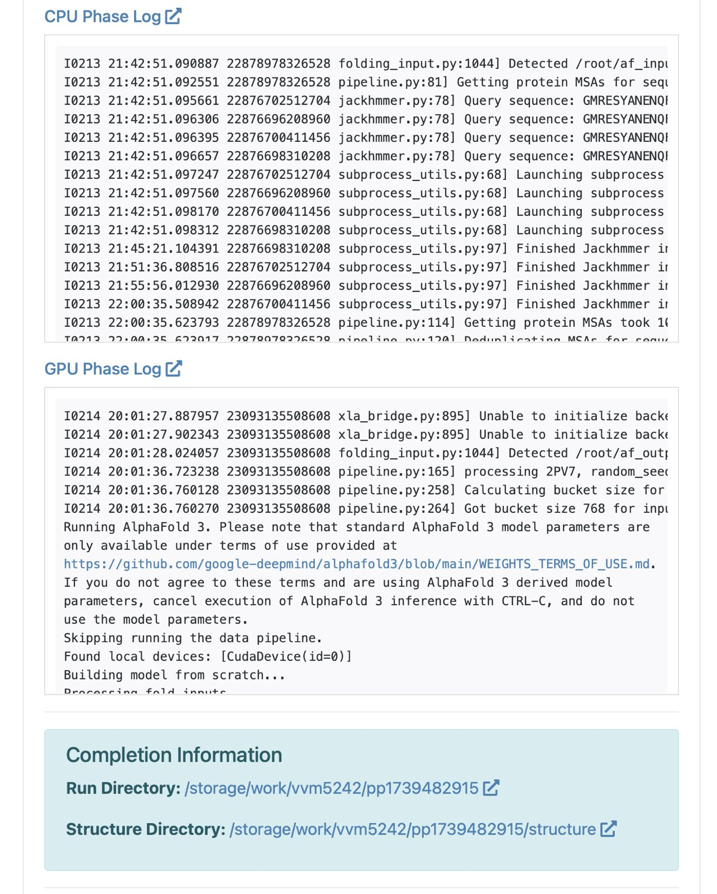

# ICDS-Roar-OOD Protein Structure Prediction

## Overview

An [Open OnDemand](https://openondemand.org/) Batch Connect app that provides a
web-based interface for running protein structure prediction jobs using AlphaFold 2
and AlphaFold 3 on the ICDS Roar cluster. The app simplifies the process of
submitting and monitoring AlphaFold jobs by providing a user-friendly interface and
automated job management.

This app uses the Batch Connect `basic` template with Slurm. It executes a two-phase
workflow: a CPU phase for MSA generation and a GPU phase for structure prediction,
with the GPU job submitted as a dependency of the CPU job.

- **Upstream project:** [AlphaFold](https://github.com/google-deepmind/alphafold) by DeepMind
- **Batch Connect template:** `basic`
- **Scheduler:** Slurm
- **Container runtime:** Singularity

## How it looks

### Launch form

| Model selection, partition & working directory (left) | JSON input & terms of service (right) |
|-------------------------------------------------------|---------------------------------------|
|                             |          |

### Progress after job submission

|-----------------------|------------------------|
|   |  |

## Supporting Materials

### Conference Materials
- <a href="https://cfp.openondemand.org/2025/talk/NYHCQF/" target="_blank" rel="noopener noreferrer">GOOD25 Conference Talk Abstract</a>
- <a href="/docs/Presentation.pdf" target="_blank" rel="noopener noreferrer">GOOD25 Conference Presentation</a>

### News Articles
- <a href="https://www.icds.psu.edu/leveraging-alphafold-in-graduate-research/" target="_blank" rel="noopener noreferrer">Leveraging AlphaFold in Graduate Research</a>
- <a href="https://www.osc.edu/press/inaugural_good_conference_draws_strong_attendance_from_10_countries" target="_blank" rel="noopener noreferrer">OSC News: Inaugural GOOD Conference Draws Strong Attendance from 10 Countries</a>

> **Presented as a talk at the Global Open On Demand Conference 2025, Harvard University**  
> **Date:** March 19, 2025, 4:00 PM – 4:25 PM (25 min)  
> **Title:** AlphaFold accessibility: an optimized open-source OOD app for Protein Structure Prediction  
> **Speakers:** Vinay Saji Mathew [Pennsylvania State University] , William Lai [Cornell], Matt Hansen [Pennsylvania State University]
> 
> **Track:** Application Track [featuring AI OnDemand]  
> **Location:** Tsai Auditorium (CGIS S010)

## Features

### Multiple Prediction Engines
- **AlphaFold 2**:
  - Supports AlphaFold v2.3.2 for protein structure prediction
  - Handles both monomer and multimer predictions
  - Uses full database configuration for maximum accuracy
  - Automated MSA generation and template search

- **AlphaFold 3** (New!):
  - Latest version of AlphaFold with improved accuracy
  - Supports protein-protein, protein-DNA/RNA, and protein-ligand complexes
  - Enhanced diffusion-based structure prediction
  - Requires acceptance of Google's terms of service

### Job Management
- **Two-phase execution**:
  - CPU phase for MSA/templates
  - GPU phase for prediction (set as a dependency)
- **Real-time job status monitoring**
- **Detailed progress tracking**
- **Automatic error handling and recovery**

### User Interface
- **Flexible Input Formats**:
  - FASTA sequence input for AlphaFold 2
  - JSON format input for AlphaFold 3 (following [official specifications](https://github.com/google-deepmind/alphafold3/blob/main/docs/input.md))
- **GPU allocation selection**
- **Working directory customization**
- **Real-time progress visualization**
- **Direct access to output files**

### Output Files
- **AlphaFold 2**:
  - PDB structure files (ranked by confidence)
  - Multiple Sequence Alignment (MSA) files
  - Detailed prediction metrics and confidence scores
  - Comprehensive log files

- **AlphaFold 3**:
  - CIF structure files
  - Ranking scores for multiple predictions
  - Detailed model outputs and metrics
  - Complete execution logs

## Prerequisites

### Open OnDemand

<!-- TODO: Specify the minimum OOD version this app has been tested with -->
- Slurm scheduler
- Has been tested to work with OOD v3 & v4

### Database Setup
Both AlphaFold versions require genetic databases that must be set up before using the app:
- AlphaFold 2: Download using script from [AlphaFold 2 repository](https://github.com/google-deepmind/alphafold)
- AlphaFold 3: Additional databases required. Setup instructions available [here](https://github.com/google-deepmind/alphafold3/blob/main/docs/installation.md)

### Singularity Containers
The app uses Singularity containers for execution:
- AlphaFold 2: Download from [Sylabs](https://cloud.sylabs.io/library/prehensilecode/alphafold_singularity/alphafold)
- AlphaFold 3: Requires official container from Google (subject to terms of use). Weights needed for running AlphaFold 3 have to be requested from Google [here](https://docs.google.com/forms/d/e/1FAIpQLSfWZAgo1aYk0O4MuAXZj8xRQ8DafeFJnldNOnh_13qAx2ceZw/viewform)

## Installation

1. Clone this repository into your Open OnDemand apps directory
2. Configure paths in `template/alphafold_env.sh`
3. Ensure all required databases are properly set up
4. Verify GPU compute capabilities.

### Configure for your site

Edit `form.yml.erb` and update these values for your cluster:

| Attribute          | ICDS Default       | Change to                          |
|--------------------|--------------------|------------------------------------|
| `cluster`          | `rc`               | Your cluster name                  |
| `auto_accounts`    | (dynamic)          | GPU account selection for your site |
| `auto_queues`      | (dynamic)          | Queue/partition for your site       |
| `working_directory`| `/scratch/<user>`  | Default scratch path on your site  |

In `before.sh.erb`, the app sources `alphafold_env.sh` to set environment variables
for database paths, container paths, and working directories. You must configure this
file for your site.

## Configuration

### form.yml attributes

| Attribute            | Widget        | Description                                          | Default               |
|----------------------|---------------|------------------------------------------------------|-----------------------|
| `session_type`       | select        | Prediction engine (AlphaFold 2 or AlphaFold 3)      | `AlphaFold 2`         |
| `auto_accounts`      | select        | GPU account for job submission                       | (dynamic)             |
| `auto_queues`        | select        | Queue/partition for job submission                   | (dynamic)             |
| `working_directory`  | path_selector | Output directory (scratch space recommended)          | `/scratch/<user>`     |
| `protein_sequence`   | text_area     | Input sequence (FASTA for AF2, JSON for AF3)         | (empty)               |
| `agree_terms`        | check_box     | Accept Google's Terms of Service (AF3 only)          | unchecked             |
| `bc_email_on_started`| check_box     | Email notification on job start/completion           | unchecked             |

## Usage

1. Access the Open OnDemand dashboard
2. Navigate to "Interactive Apps"
3. Select "Protein Structure Prediction"
4. Choose prediction engine (AlphaFold 2 or 3)
5. Fill out the form:
   - For AlphaFold 2: Enter protein sequence in FASTA format
   - For AlphaFold 3: Provide input in JSON format
   - Select GPU allocation
   - Choose working directory
6. Accept terms of service (required for AlphaFold 3)
7. Submit the job

### Input Format Examples

#### AlphaFold 2 (FASTA)
The app accepts protein sequences in FASTA format.

Example:
```
>sequence_name
MVKVGVNGFGRIGRLVTRAAFNSGKVDIVAINDPFIDLNYMVYMFQYDSTHGKFHGTVKA
ENGKLVINGNPITIFQERDPSKIKWGDAGAEYVVESTGVFTTMEKAGAHLQGGAKRVIIS
```

#### AlphaFold 3 (JSON) 

```
{
"name": "example_complex",
"sequences": [
{
"protein": {
"id": "protein_chain_A",
"sequence": "MVKVGVNG..."
}
}
],
"modelSeeds": [1, 2, 3]
}
```


### Output Files
The app generates the following output structure:

```
working_directory/
└── run_YYYYMMDD_HHMMSS/
├── input/
│ ├── [structure files] # Predicted structures
│ ├── [prediction data] # Detailed predictions
│ └── msas/ # Multiple sequence alignments
├── logs/ # Job logs
├── CPU-SLURM/ # CPU phase files
└── GPU-SLURM/ # GPU phase files
```


## Monitoring Jobs
The app provides real-time monitoring of:
- MSA generation progress
- Template search status
- Structure prediction progress
- Model relaxation status

## Troubleshooting
Common issues and solutions:

1. Job fails in CPU phase:
   - Check available disk space
   - Verify database paths
   - Examine CPU phase logs

2. GPU phase errors:
   - Verify GPU allocation
   - Check memory requirements
   - Review GPU phase logs
   - For AlphaFold 3: Ensure GPU compute availability. 


## Contributing

For bugs or feature requests,
[open an issue](https://github.com/EpiGenomicsCode/ProteinStructure-OOD/issues).

## References

- [AlphaFold 2](https://github.com/google-deepmind/alphafold) -- protein structure prediction by DeepMind
- [AlphaFold 3](https://github.com/google-deepmind/alphafold3) -- latest version with protein-ligand complex support
- [Open OnDemand](https://openondemand.org/) -- the HPC portal framework
- [OOD Batch Connect app development docs](https://osc.github.io/ood-documentation/latest/app-development.html)

## License

MIT (see LICENSE file)

## Acknowledgements
- AlphaFold by DeepMind Technologies Limited
- Singularity container by prehensilecode
- The research project is generously funded by Cornell University BRC Epigenomics Core Facility (RRID:SCR_021287), Penn State Institute for Computational and Data Sciences (RRID:SCR_025154) , Penn State University Center for Applications of Artificial Intelligence and Machine Learning to Industry Core Facility (AIMI) (RRID:SCR_022867) and supported by a gift to AIMI research from Dell Technologies.
- Computational support was provided by NSF ACCESS to William KM Lai and Gretta Kellogg through BIO230041

## Contact
For questions or issues, please contact:
- Technical support: vinaysmathew@psu.edu
- ICDS support: icds@psu.edu
